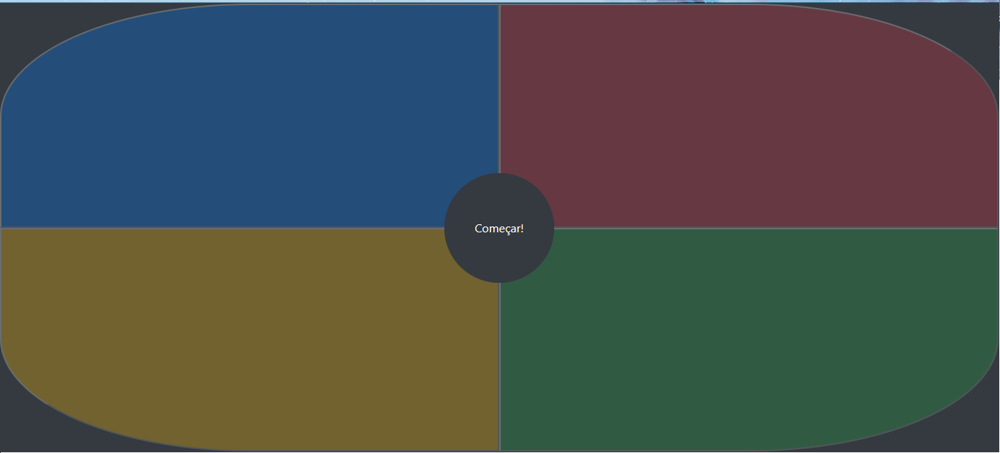

# Genius- JavaScript

Projeto pessoal de estudos, onde desenvolvo um jogo de memorização de cores inspirado no jogo original chamado Genius. 

### 💻 Interface 

Abaixo temos a tela do jogo desenvolvida com em HTML5, CSS3 e Bootstrap. 




********************************************

## 🚀 Começando

Para obter uma cópia deste projeto:

```shell
git clone https://github.com/adrianomqsmts/genius-js
cd genius-js
```

## 🛠️ Construído com

Ferramentas, linguagens e outras tecnologias usadas no desenvolvimento deste sistema.

* [Visual Studio Code](https://code.visualstudio.com/docs) - Ambiente de Desenvolvimento
* [Git](https://git-scm.com/) - Controle de Versões
* HTML5
* CSS3
* [Bootstrap 5](https://getbootstrap.com/docs/5.1/getting-started/introduction/) - Framework
* [Javascript](https://www.javascript.com/) - Linguagem de Programação


## ✒️ Autores

* **Desenvolvedor** - *Código e Documentação* - [Adriano](https://github.com/adrianomqsmts)

## 📄 Licença

Este projeto está sob a licença MIT License - veja o arquivo [LICENSE.md](https://github.com/adrianomqsmts/genius-js/blob/master/LICENSE) para detalhes.

---
